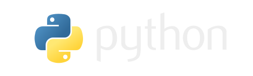

# 

Python is a general-purpose language, which means it’s designed to be used in a range of applications, including data science, software development, automation, desktop and even in embedded development.

Python is an interpreted, object-oriented, high-level programming language with dynamic semantics. Its high-level built in data structures, combined with dynamic typing and dynamic binding, make it very attractive for Rapid Application Development, as well as for use as a scripting or glue language to connect existing components together.

Python's simple, easy to learn syntax emphasizes readability and therefore reduces the cost of program maintenance. Python supports modules and packages, which encourages program modularity and code reuse. The Python interpreter and the extensive standard library are available in source or binary form without charge for all major platforms, and can be freely distributed

## History of Python

Python, a successor to the programming language ABC, is perhaps the only programming language that was named after a cult TV show.

When Python creator Guido van Rossum was working on the language in the late 1980s, he was reading the published scripts from Monty Python’s Flying Circus, an off-the-wall British comedy series from the 1970s.

Needing a unique, catchy name people would remember, Python stuck. Its first iteration was released in 1991 as Python 0.9.0. Python 2.0 was subsequently released in 2000, with Python 3.0 following in 2008. Python 2 was discontinued with the release of version 2.7.18 in 2020.

This programming language consistently ranks as the second most popular in the world. SlashData, a leading analyst firm in the developer economy, estimated that Python gained more than two million new developers in 2018. And in 2019, Zdnet reported that Python was now more popular than Java. That year, there were 8.2 million developers in the world coding using Python, compared to those using Java at 7.6 million.

## What Python can do?

Python is commonly used for developing websites, software, task automation, data analysis, and data visualization.

Since it’s relatively easy to learn, Python has been adopted by many non-programmers such as accountants and scientists, for a variety of everyday tasks, like organizing finances, web development (server-side), software development, mathematics and system scripting among many more tasks.

**PYTHON** can do a lot, if not everything. Here is a few of the most common uses of Python.

### Data analysis

Python has become a staple in data science, allowing data analysts and other professionals to use the language to conduct complex statistical calculations, create data visualizations, build machine learning algorithms, manipulate and analyze data and complete other data-related tasks.

Python can build a wide range of different data visualizations, like line and bar graphs, pie charts, histograms, and 3D plots. Python also has a number of libraries that enable coders to write programs for data analysis and machine learning more quickly and efficiently, like TensorFlow and Keras.

### Web development

Python is often used to develop the back end of a website or application—the parts that a user doesn’t see. Python’s role in web development can include sending data to and from servers, processing data and communicating with databases, URL routing, and ensuring security. Python offers several frameworks for web development. Commonly used ones include Django and Flask.

Some web development jobs that use Python include back-end engineers, full stack engineers, Python developers, software engineers and DevOps engineers.

### Automation or scripting

If you find yourself performing a task repeatedly, you could work more efficiently by automating it with Python. Writing code used to build these automated processes is called scripting.
In the coding world, automation can be used to check for errors across multiple files, convert files, execute simple math, and remove duplicates in data.

Python can even be used by relative beginners to automate simple tasks on the computer—such as renaming files, finding and downloading online content or sending emails or texts at desired intervals.

### Everyday tasks

Python isn't only for programmers and data scientists. Learning Python can open new possibilities for those in less data-heavy professions, like journalists, small business owners, or social media marketers. Python can also enable non-programmers to simplify certain tasks in their lives. Here are just a few of the tasks you could automate with Python:

Keep track of stock market or crypto prices.

Send yourself a text reminder to carry an umbrella anytime it’s raining.

Update your grocery shopping list.

Renaming large batches of files.

Converting text files to spreadsheets.

Randomly assign chores to family members.

Fill out online forms automatically.

### AI and machine learning

Because Python is such a stable, flexible and simple programming language, it’s perfect for various machine learning (ML) and artificial intelligence (AI) projects.
In fact, Python is top favourite language among data scientists, and there are many Python machine learning and AI libraries and packages available.

### General Application Development

You can program all kinds of applications using Python. The general-purpose language can be used to read and create file directories, create GUIs and APIs and more.

Whether it’s a blockchain application, audio and video apps, or machine learning applications, or just another desktop application, you can build them all with Python.

### Game development

Although it's not the industry-standard in game development, Python does have its uses in the industry. It’s possible to create simple games using the programming language, which means it can be a useful tool for quickly developing a prototype. Similarly, certain functions (such as dialogue tree creation) are possible in Python.

### Write other languages

Yes, you can write your very own language easily with Python.
There are many other languages written in Python or there interprators done in Python.

Just but to name a few languages:

* Fish
* SELECT
* Zucchini
* Brainfuck
* 2L
* Befunge (93 and 98)
* Thue
* Aheui
* Udage
* Linguine
* Quantum Brainfuck
* Dimensifuck
* ThaM
* Recurse
* Condit
* Subleq
* Redivider
* FerNANDo
* Suzy
* Gibberish
* Madbrain
* Pirandello
* Arborealis
* Merthese
* Numberwang
* Geom Geom++
* Stlang
* ZeptoBasic
* Bueue
* Fractran
* Befunk
* Pyth
* Aubergine
* UberGenes
* ResPlicate
* Silberjoder
* Nopfunge
* PyPy

### Finance

Python is increasingly being utilised in the world of finance, often in areas such as quantitative and qualitative analysis. It can be a valuable tool in determining asset price trends and predictions, as well as in automating workflows across different data sources.

As mentioned already, Python is an ideal tool for working with big data sets, and there are many libraries available to help with compiling and processing information. As such, it’s among the preferred languages in the finance industry besides Ruby and Java.

### SEO OPTIMIZATION

SEO is an area that often benefits from automation, which is certainly possible through Python. Whether it’s implementing changes across multiple pages or categorising keywords, Python can help.

Emerging technologies such as natural language processing (NLP) are also likely to be relevant to those working in SEO. Python can be a powerful tool in developing these NLP skills and understanding how people search and how search engines return results.

### Graphic Design

Python can be used to develop graphic design applications. Surprisingly, the language is used across a range of 2D and 3D imaging software, such as Paint Shop Pro, Gimp, Lightwave, Blender, Cinema 4D, among others.

Python is also heavily used in unreal image generation.

## EMPLOYERBILITY

Computer programming was a rare demanded skill in IT jobs. Today, many IT jobs require a solid grasp of more than one top programming languages.

2023 becomes the most vital period that could predict the future of language demand. That is why it is important to use statistics from this period when Ai is considerably the future.

So, incase you plan to advance your career or change careers completely, then you are required to master a programming language.

You might be at crossroads, wondering which one to learn and master. After all, it will take time and money to learn the language, so you want to make the right choice!

When making your decision, you should bear several considerations in mind:

* The steepness of the learning curve your mind and heart can handle.
* The programming language knowledge you already possess that meshes with your existing coding skills. Remember, we are not talking about just learning a language, but commanding a language.
* The main area of focus you wish to concentrate on.
* The industry you wish to work in; or your reasons for learning a top programming language.
* In this section, we focus on employerbility; the best programming languages in demand among employers in 2023.

### 1 - JavaScript / TypeScript

Currently JavaScript is the most demanded programming language in the entire market. Also, the arrival of TypeScript (a JavaScript superset with type safety) is a MUST in achieving this job.

Well, before 2023, most employers would only want JavaScript. But nowadays, employers expect a JavaScript developer to be well grounded in TypeScript. Thus, if you see a vacancy for JavaScript developers, do not ask questions when they present you pure TypeScript interview. Now you know!

Many new JavaScript frameworks are entirely written with TypeScript, like Angular or NestJS. And many companies are now migrating to TypeScript. They need migration powerhouses.

In a quarter, 29% of jobs (well over 900k) on interview, explicitly required JavaScript (by extention, TypeScript) as a programming language; and over half, are yet to be filled!

#### Skills Needed

* **Front-end frameworks:** Have knowledge of React, Angular, and Vue. Be proficient in one of them by building responsive web applications.
* **Server-side development:** Have extensive knowledge of Node.js, ExpressJS and any other top backend language.
* **Asynchronous development:** This is a core feature of JavaScript. You must be able to write asynchronous objects with your eyes closed!
* **Testing and Debugging:** Knowing how to write effective tests and debug complex issues is in high demand.
* **Web performance optimization:** Well, writing huge applications and stuffing components to it, can be easier, but serving a web page with what is only needed at that moment, is a challenge of its own kind.
Be grounded in lazy loading, code splitting, caching and CSS optimization.
* **Mobile Development:** Be proficient in React Native and or Ionic.
* **Progressive web development (PWAs):** Writing applications with native like experience to users is a demand skill because web workers and web app manifests are becoming a must tool.
* **Cross-Browser Code:** Well, JavaScript behaves differently in different browsers. The reason many developers forsake it for other languages. But if you can master the skills that can make JavaScript behave the same way in all browsers, then your chances of landing a high paying job is nigh.
* **Redux:** while there are many better state management tools like Zustand, you still need a solid grasp on Redux.
* **jQuery:** Other interviewers only test this skill. They want to see how you can make it so easy to traverse the DOM and manipulate CSS, animations and Ajax.
* **HTML and CSS:** Have understanding of CSS files, inline styles and frameworks. Be proficient at least in one framework and regular CSS.
* **Algorithms and Data Structures:** Most employers want to solve very complex arithmetic problems. You need to have a solid understanding of Data structures and algorithms.
* **Source Control:** Most employers have a bunch of developers who contribute to features. Understanding of code versioning, source code backups and collaboration is key.
* **Encryption and Cryptography:** As a Javascript developer, you must have solid understanding of encryption algorithms, authentication functions and most secure cryptography techniques.
* **Basic Design ability:** JavaScript employment industry is critical in focusing on best practices
* **Problem Solving Methods:** The methods you apply to solve a problem are key. Take good time to practice alot of approaches in handling different tasks.

### 2- Python

Python has made its journey to be the second most demanded programming language in 2023. Its versatility, from scripting, running servers or for data analysis, has been key to achieving this milestone.

Also, Python has one of the greatest and biggest communities, after JavaScript.

It is estimated that, a total of over 600K job offers are, and will be, at disposal per annum. This accounts for way over 20% of jobs that explicitly require Python.

#### Most Sought Skills

* **General Fluency in the Python**
  * Core Python expertise in python best practices,
  * Generators
  * Iterators
  * File handling concepts
  * Exception handling
  * OOPs concepts
  * Data types and variables
  * Data structures
* **Python frameworks and libraries**
  * Many employers and Python projects use specific frameworks and libraries and will only hire devs who are familiar with those.
* **HTML, CSS, JavaScript**
  * Python devs frequently work with front-end tools and technologies. Thus, knowing HTML, CSS, and JavaScript can help them see and understand the bigger picture of how platforms, websites, or web apps should look and work.
  * So a grasp of HTML, CSS, JavaScript is a plus; though does not necessarily matter in other cases.
* **Understanding Object Relational Mappers (ORMs)**
  * ORMs or Object Relational Mappers facilitate data transfer from relational databases to Python objects. They are a class of libraries that convert data from an incompatible type to a type that can be used in Python. ORMs are great to learn because they can save devs a lot of time.
* **Artificial Intelligence and Machine Learning**
  * The vast majority of data scientists and engineers use Python at some point. And if you’d like to work in data science, it’s good to add some AI and machine learning skills to your repertoire. AI/ML skills can also come in handy outside of data science, as many organizations and businesses have begun including both in their strategies.
* **Version Control**
  * Any developer should have a firm grasp of version control tools. Practically every potential employer expects developers to know how to manage version control.
* **Good Debugging Skills**
  * Python developers aren’t just responsible for writing and maintaining code. They should also have some good debugging skills that can help them diagnose and fix issues in their projects. It’s also a good idea to learn some unit testing skills.
* **Understanding Multi-Process Architecture**
  * One of the Python skills in demand today is being able to understand and work with multi-process architecture. Although design engineers are often responsible for knowing the codes used in release and deployment, developers must also have at least a basic understanding.
  * If you want to succeed as a Python developer, it’d be good to know about the Model View Template (MVT) and Model View Controller (MVC) architectures.
* **Soft Skills**
  * Like any other developer, Python devs should have some soft skills that make it possible to work well with others. That means having good communication skills and being able to collaborate with other developers and team members. Other great soft skills to have include patience and attention to detail.

### 3 - Java

The third most in demand programming language, we find Java!, a language that has been really popular since its creation in 1995.

Even though this popularity has been decreasing over the last years with the appearance of more modern languages like Kotlin and C#, it still holds a solid top three spot. Frameworks like Spring, used in many top tier companies, are helping to tightly hold on that position with their dear life.

Given the fact that Java is mostly used in financial applications, and that schools are rarely teaching it at large, companies feel more secure sticking to it.

### 4 - C Sharp

The top four spot goes to C#. C# is a general purpose, multi-paradigm, object-oriented programming language, created mainly to address some of the weaknesses of C++; but on a bigger margin, to be better than Java.

As a general purpose language, C# has a wide range of use cases. The most common usage of C# is with the .NET framework. It is also heavily used in the Unity game framework for scripting. Both .NET framework and Unity are popular among top tier companies.

### 5 - PHP

Yes, you heard me! The language that Twenty-seven years ago started as a simple “Personal Home Page Tool”, hence the name PHP, has made an incredible journey since then. As of May 2023, PHP accounts for 10% of the total demand for developer job offers, meaning that 1 out of 10 development jobs require PHP.

The strength of PHP is propelled by freelancers sites for clients who want rapid web development. Most of this clients aren't interested in professional or best practice work, hence, a good place for beginners. On this sites, PHP developers earn more jobs than all other language developers put together 😋.

### 6 - C++

C is a general-purpose programming language created by Dennis Ritchie at the Bell Laboratories in 1972.
C++ was developed by Bjarne Stroustrup at Bell Laboratories over a period starting in 1979. Since C++ main intention was to add object-oriented features (plus other improvements) to C, earlier it was called “C with Objects” or “C with Classes”. As the language developed, Stroustrup named it as C++ in 1983.
In this long window of time, C++ has maintained its popularity with regular additions and improvements to the language. Modern C++ includes object-oriented, generics and also functional features. It also facilitates low level memory manipulation. Its usage in the industry is widely extended, C++ can be found on video games, servers, databases, space probes and many others.

Well, just like TypeScript is to JavaScript, employers demand C++ in place of C. It is rare to get a job as a C developer and you may be shocked to get a pure C++ interview when you apply for 'an advertised C job'.

Though in general, C++ and Java demand appears to have slowed down in 2023 tremendously, due to emergence of TypeScript versartility and the growing libraries, ofcourse written in C++ itself.
Thus, most employers opt to incorporate C++ libraries rather than employing C++ developers, who are more highly priced.

### 7 - Ruby

Ruby, the most secure programming language, holds the top seven most demanded programming language with way over 130K jobs per annum. Its most popular usage comes in conjunction with the web framework Ruby on Rails. Even though top seven may not seem much, Ruby runs some of the top tech companies nowadays, like Twitter, Crunchbase or Github.

### 8 - Go

Go is a young language created by Google. Google designed Go to improve programming productivity in an era of multicore, networked machines and large codebases.

The job demand for Go programming language remains stable more than 50K job opportunities available per annum.

Top tier companies like Uber or Twitch are using Go.

### Verdict

**NB:** Github can act as a great gateway to your new employer. Make sure you don't use the tutorial (on youtube and other resources) follow along(s) applications, or copy paste(s) on your public repositories. Use your own work, done by your own creativity and skills. Other peoples work, depicted as yours can have a damaging effect to your resume.

Well, there is luck and there is work. If you depend or hope to be the lucky one, we thank God. But if you want to be sure of handling any interview that is flooded with thousands of applicants, then wisely choose a language that you can become proficient in.

Great skills with a strong social network can guarantee you a spot in top paying opportunities.
As you take the journey to specialize in your skills, learn to update your challenges in the social network.
Especially the in the:

* 
* My starved [stack 😋](https://stackoverflow.com/users/10513851/adioz-daniel)
* 

Ruby is the most secure programming language. C++ is the most powerful programming language that can do better, at anything, than any other language can do. Julia is far much better than Python, C# is far much better than Java, but the eyes have it.

Given the above attributes, this makes also this vacancies and their interviews more tougher. Industries only take in developers who are at the helm of skills in the above languages; with exemption to PHP.
Thus, if your interest is a job, then you know what to focus on.

### Chart

This repository, is under development. It is meant for both beginners and intermediate developers who want to learn JavaScript in depths.

## Contact

Feel free to reach out with any questions, suggestions, or contributions to:

* [Contact Engineer Adioz Daniel](mailto:<adiozdaniel@gmail.com>?subject=[_Collaboration_on_PYTHON_ENGINEERING_FULL_COURSE])

* [Contact Engineer Happy Chukwuma](mailto:<happychukwuma@gmail.com>?subject=[_Collaboration_on_PYTHON_ENGINEERING_FULL_COURSE])
